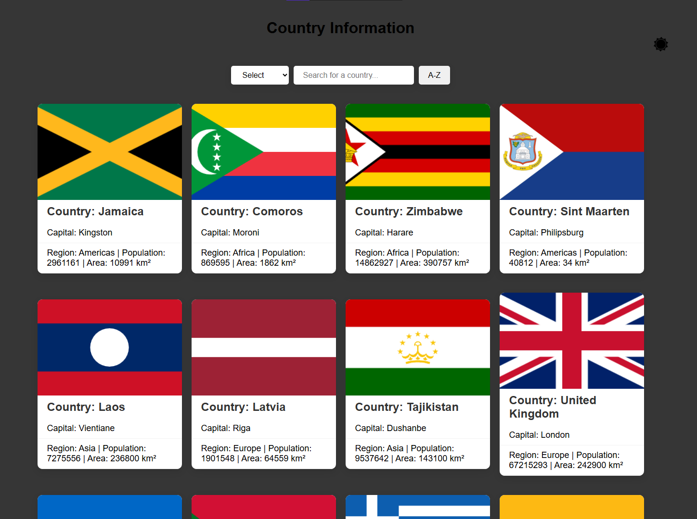

# 🌍 Country Information App



> *“Why Google when you have this app? 😎”*  

---

## 📖 What is this project?

This project is a **Country Information Web App** built with **HTML, CSS, and JavaScript**.  
It fetches data from a REST API and shows useful information about each country:  

- Name 🏷️  
- Capital 🏛️  
- Region 🌎  
- Population 👥  
- Area 📐  

You can **search**, **sort**, and **filter** countries with ease.

---

## ✨ Features

- 🔍 **Search bar** — find any country instantly  
- 🗂️ **Sort** — Alphabetical order (A–Z / Z–A)  
- 🌍 **Filter** — by region (Asia, Europe, Africa, etc.)  
- 🎨 **Responsive UI** — clean design, card-based layout  
- 🌑 **Dark/Light mode** toggle  

---

## 🛠️ Tech Stack

- ⚡ **JavaScript (ES6)** — interactivity & API handling  
- 🎨 **CSS3** — responsive design & hover effects  
- 🧩 **HTML5** — structure and layout  

---

## 🚀 How to run?

```bash
# 1. Clone the repository
git clone https://github.com/USERNAME/Country-Info-App.git

# 2. Go into the folder
cd Country-Info-App

# 3. Open index.html in your browser
```

That’s it! 🎉  

---

## 📂 Project Structure

```
Country-Info-App/
│── index.html
│── css/
│   └── style.css
│── js/
│   └── script.js
│── screenshot.png
└── README.md
```

---

## 🌱 Roadmap

- ✅ Search & sort features  
- 🌑 Dark/Light theme toggle  
- 📌 Add more country details (currency, languages, flags)  
- 📱 Mobile-first improvements  

---

## 🤝 Contributing

1. Fork this repo  
2. Create a new branch (`git checkout -b feature/awesome-feature`)  
3. Commit changes (`git commit -m "Added awesome feature"`)  
4. Push (`git push origin feature/awesome-feature`)  
5. Open a Pull Request 🚀  

---

## 📜 License

Released under the **MIT License**.

---

## 💡 Final Words

*“Travel the world without leaving your browser tab.”* 🌍✨  

---

# 🇺🇿 O‘zbekcha Versiya


> *“Google qidiruvchiga hojat yo‘q, endi sening qo‘lingda bu app bor! 😎”*  

---

## 📖 Bu loyiha nima?

Bu loyiha — **Country Information Web App**, ya’ni davlatlar haqida ma’lumot ko‘rsatuvchi web-ilova.  
U REST API’dan foydalanadi va quyidagi ma’lumotlarni chiqaradi:  

- Davlat nomi 🏷️  
- Poytaxt 🏛️  
- Mintaqa 🌎  
- Aholisi 👥  
- Maydoni 📐  

Shuningdek, **qidirish**, **saralash** va **filtrlash** imkoniyatlari mavjud.

---

## ✨ Xususiyatlari

- 🔍 **Qidiruv paneli** — davlatni tez topish  
- 🗂️ **Saralash** — alifbo tartibida (A–Z / Z–A)  
- 🌍 **Filtrlash** — mintaqalar bo‘yicha (Osiyo, Yevropa, Afrika va h.k.)  
- 🎨 **Responsiv dizayn** — karta ko‘rinishida chiroyli UI  
- 🌑 **Dark/Light rejim** almashtirish  

---

## 🛠️ Ishlatilgan texnologiyalar

- ⚡ **JavaScript (ES6)** — interaktivlik va API ishlovchi kod  
- 🎨 **CSS3** — responsiv dizayn va hover effektlar  
- 🧩 **HTML5** — tuzilma va layout  

---

## 🚀 Qanday ishga tushirish?

```bash
# 1. Reponi klon qiling
git clone https://github.com/USERNAME/Country-Info-App.git

# 2. Papkaga kiring
cd Country-Info-App

# 3. index.html faylini brauzerda oching
```

Shundan so‘ng app ishlay boshlaydi 🎉  

---

## 📂 Loyiha tuzilmasi

```
Country-Info-App/
│── index.html
│── css/
│   └── style.css
│── js/
│   └── script.js
│── screenshot.png
└── README.md
```

---

## 🌱 Reja

- ✅ Qidiruv va saralash imkoniyatlari  
- 🌑 Dark/Light rejimi  
- 📌 Qo‘shimcha ma’lumotlar (valyuta, tillar, bayroq)  
- 📱 Mobil moslashuvni yaxshilash  

---

## 🤝 Hissa qo‘shish

1. Reponi fork qiling  
2. Yangi branch yarating (`git checkout -b feature/awesome-feature`)  
3. O‘zgarishlarni commit qiling (`git commit -m "Yangi funksiya qo‘shildi"`)  
4. Push qiling (`git push origin feature/awesome-feature`)  
5. Pull Request oching 🚀  

---

## 📜 Litsenziya

MIT License ostida tarqatiladi.

---

## 💡 Yakuniy gap

*“Sayohat qilish uchun chipta shart emas — brauzeringning tab’i yetarli.”* 🌍✨
